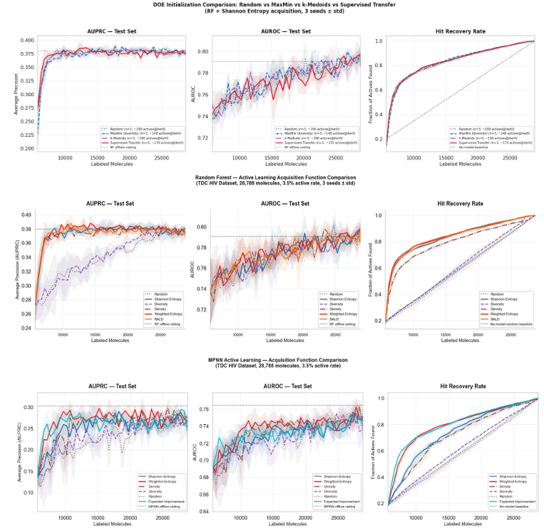

<p align="center">
  
</p>

# MolAL: Molecular Active Learning for Molecular Hit Identification using HIV Drug Discovery Data

**Course:** CMU 02-750 Automation of Scientific Research  
**Authors:** Juhi Munmun Gupta, Sumeet Kothare
**Dataset:** TDC HIV High-Throughput Screening (41,127 molecules, 3.5% active rate, scaffold split)

---

## Project Overview

This project benchmarks pool-based active learning strategies for molecular hit identification on the TDC HIV dataset. We compare two base learners (Random Forest with Morgan fingerprints, MPNN with graph-based representations) across six acquisition functions (Shannon Entropy, Weighted Entropy, BALD, Diversity, Density, Random) and four initialization strategies (Random, MaxMin, k-Medoids, Supervised Transfer).

The central question: **can active learning recover HIV inhibitors faster than random screening under severe class imbalance?**

---

## Results Overview



**Top row — DOE Initialization:** All four initialization strategies (Random,
MaxMin, k-Medoids, Supervised Transfer) converge to identical performance
within two AL iterations. Acquisition function design, rather than an initialization strategy, drives sample efficiency under severe class imbalance.

**Middle row — Random Forest:** Imbalance-aware acquisition functions (Weighted Entropy, BALD) achieve best hit recovery. Diversity sampling performs at the level of random screening.

**Bottom row — MPNN:** Expected Improvement and Weighted Entropy recover
~80% of HIV actives at 50% labeling budget. Higher variance than RF reflects
graph representation instability under 3.5% active rate.

---

## Repository Structure

```
ASR_Project/
├── colab_runner.ipynb          # Main experiment notebook (see Cell Guide below)
├── visualize.ipynb             # Plotting and analysis notebook
├── preprocessing/
│   └── data/
│       ├── data_loader.py      # TDC loading, Morgan fingerprints, scaffold split
│       ├── graph_builder.py    # SMILES → PyG Data objects (9 atom + 4 bond features)
│       ├── rf_auprc_all_seeds.xlsx      # RF AUPRC results (all conditions, 3 seeds)
│       ├── rf_auroc_all_seeds.xlsx      # RF AUROC results
│       ├── rf_hit_recovery_all_seeds.xlsx  # RF hit recovery results
│       ├── mpnn_auprc_all_seeds.xlsx    # MPNN AUPRC results
│       ├── mpnn_auroc_all_seeds.xlsx    # MPNN AUROC results
│       └── mpnn_hit_recovery_all_seeds.xlsx # MPNN hit recovery results
├── initialization/
│   ├── random_init.py          # Uniform random selection
│   ├── maxmin_init.py          # MaxMin Tanimoto diversity (greedy farthest-first)
│   ├── kmedoids_init.py        # k-Medoids cluster-representative selection
│   └── supervised_init.py      # Transfer-learning init (SARS-pretrained RF filter + MaxMin)
├── models/
│   ├── random_forest_model.py  # RF wrapper: entropy, BALD (tree committee), weighted, random
│   └── mpnn_model.py           # NNConv MPNN + MC Dropout UQ + warm/cold start + EI
├── active_learning/
│   └── al_loop.py              # Unified AL loop for RF and MPNN; warm_start toggle
├── evaluation/
│   └── metrics.py              # AUPRC, AUROC, hit recovery
├── experiments/
│   └── run_doe_comparison.py   # DOE initialization grid (random × maxmin × kmedoids)
└── results/
    ├── graph_cache/            # Cached PyG graphs (avoids rebuilding each session)
    ├── passive_baselines.json  # Offline RF and MPNN AUPRC/AUROC
    ├── al_RF_entropy_seed*.json          # RF condition checkpoints
    ├── al_MPNN_entropy_seed*.json        # MPNN condition checkpoints
    └── doe_supervised_*_seed*.json       # DOE initialization experiment checkpoints
```

---

## Colab Session Startup (every new session)

Run these cells in order before anything else:

| Step | Cell | What it does |
|------|------|--------------|
| 1 | **Cell 1** (code cell 2) | Install packages. Auto-restarts runtime. |
| 2 | **Cell 1b** (code cell 3) | Verify all imports after restart. |
| 3 | **Cell 2** (code cell 4) | Mount Google Drive. |
| 4 | **Cell 3** (code cell 6) | Set `PROJECT_ROOT` on `sys.path`. |
| 5 | **Cell 4** (code cell 8) | Verify `__init__.py` files exist. |
| 6 | **Cell 5** (code cell 10) | Load HIV data → creates `data` object. |

After these six cells, `data`, `data.X_train_pool`, `data.y_train_pool`, etc. are in memory.

---

## Experiment Guide

### 1. DOE Initialization Experiments

**Cells to run:** Cells 1–5 (startup), then:

| Cell | Purpose |
|------|---------|
| Cell 6 (code 14) | Configure `INIT_FRACTION`, `BATCH_SIZE`, `N_SEEDS` |
| Cell 7 (code 16–17) | Run Random vs MaxMin vs k-Medoids initialization comparison |
| Cell 8 (code 19) | Plot DOE results from saved checkpoints |
| Cell DOE-S0 (code 24) | Install umap-learn for visualization |
| Cell DOE-S1 (code 25) | Verify `supervised_init.py` is present |
| Cell DOE-S2 (code 26) | Load SARS dataset, decontaminate, train transfer classifier |
| Cell DOE-S3 (code 28) | Compare all 4 strategies at iteration 0 |
| Cell DOE-S4 (code 30) | UMAP chemical space visualization |
| Cell DOE-S5 (code 31) | Full AL loop × 4 initialization strategies × 3 seeds |
| Cell DOE-S6 (code 32) | Plot DOE-S5 results |

**Checkpoints saved to:** `results/doe_supervised_{condition}_seed{seed}.json`

---

### 2. RF and MPNN Passive Baselines

**Cells to run:** Full startup (Cells 1–5) plus graph cache, then:

| Cell | Purpose |
|------|---------|
| Cell A3 (code 39) | Load HIV data + build/load cached PyG graphs |
| Cell A4 (code 41–42) | Train RF and MPNN on full pool → offline AUPRC ceiling |

**Output saved to:** `results/passive_baselines.json`

**Expected results:** RF passive AUPRC ≈ 0.38, MPNN passive AUPRC ≈ 0.30

---

### 3. RF Active Learning

**Cells to run:** Full startup + Cell A3 + Cell A4, then:

| Cell | Purpose |
|------|---------|
| Cell A5 (code 44–45) | `run_and_log` definition + RF entropy + RF weighted (3 seeds each) |
| Cell RF+BALD (code 47) | Standalone RF BALD run (3 seeds) |

Each RF seed takes ~5 minutes. All 6 conditions (entropy, weighted, BALD, density, diversity, random) can run in under 2 hours total.

**Checkpoints saved to:** `results/al_RF_{acquisition}_seed{seed}.json`

---

### 4. MPNN Active Learning

**Cells to run:** Full startup + Cell A1 + Cell A2 (WandB login) + Cell A3 + Cell A4, then:

| Cell | Purpose |
|------|---------|
| Cell A6 (code 50) | `MPNN_CONFIG` definition |
| Cell A3+Cell A9 (code 64–65) | **Recommended:** self-contained cell for all MPNN conditions |

**Cell A9** is the recommended way to run MPNN experiments. It is fully self-contained: defines `RESULTS_DIR`, loads WandB credentials, defines `run_and_log`, and includes checkpoint skipping so interrupted runs resume safely.

To add a new acquisition function (e.g., Expected Improvement), uncomment the relevant block at the bottom of Cell A9:

```python
mpnn_ei = run_and_log(
    'MPNN', 'expected_improvement',
    lambda s: MPNNModel(seed=s, **MPNN_CONFIG),
    seeds=[0, 1, 2]
)
```

**Toggle warm vs cold start** at the top of Cell A9:
```python
WARM_START = False   # False = cold start (matches teammate); True = warm start
```

Each MPNN seed takes ~90–120 minutes on a T4/A100 GPU.  
**Checkpoints saved to:** `results/al_MPNN_{acquisition}_seed{seed}.json`

**Session budget (12-hr Colab limit):**
- Session 1: random (3 seeds) + entropy seed 0 ≈ 5.5 hrs
- Session 2: entropy seeds 1,2 + EI seeds 0,1,2 ≈ 6 hrs
- Checkpoint skipping means no work is lost between sessions.

---

### 5. MPNN + Morgan FP Fusion

| Cell | Purpose |
|------|---------|
| Cell A7 (code 58) | Build FP-augmented graphs, run MPNN_FP × weighted and BALD |

---

## Key Design Decisions

| Decision | Choice | Rationale |
|----------|--------|-----------|
| Initialization fraction | 20% (5,757 molecules) | Convergence analysis across 5%–25% showed rapid catch-up from any starting point |
| AL batch size | 500 | Grid search showed batch 250 marginally better but 500 gives comparable performance with fewer iterations |
| Positive class weight | 10.0 | Reduces false negative rate under 96.5% inactive rate without over-correcting |
| MC Dropout samples | T=10 | Balance between UQ quality and inference speed (4× faster than T=30) |
| Warm start | Cold start (default) | Matches teammate runs; warm start available via `WARM_START=True` flag |
| Graph features | 9 atom + 4 bond features | Captures atomic number, ring membership, aromaticity, bond order, conjugation |

---

## Acquisition Functions

| Function | Formula | Implemented in |
|----------|---------|----------------|
| Shannon Entropy | H(p̂) | `RandomForestModel.uncertainty()`, `MPNNModel.uncertainty('entropy')` |
| Weighted Entropy | H(p̂) × p̂_active | `al_loop.py` (RF), `MPNNModel.uncertainty('weighted')` |
| BALD | H(p̂_mean) − E[H(p̂_t)] | `RandomForestModel.bald_uncertainty()`, `MPNNModel.uncertainty('bald')` |
| Expected Improvement | EI formula (scipy.stats.norm) | `RandomForestModel.expected_improvement()`, `MPNNModel.uncertainty('EI')` |
| Diversity (k-Means) | Cluster centroid selection | `al_loop.py` RF branch |
| Density | Entropy × cosine similarity | `al_loop.py` RF branch |
| Random | Uniform random | `al_loop.py` both branches |

---

## visualize.ipynb Overview

`visualize.ipynb` loads the Excel result files and produces all figures and tables for the paper.

**RF Section (Cells 1–10):**
- Loads `rf_auprc_all_seeds.xlsx`, `rf_auroc_all_seeds.xlsx`, `rf_hit_recovery_all_seeds.xlsx`
- RF BALD data fetched from WandB API (run IDs: seed0=`48n6tbbr`, seed1=`8duvvl8b`, seed2=`hmlezaly`) and cached to `results/rf_bald_*.json`
- Produces: 3-panel learning curves, 2-panel AUPRC+hits, combined efficiency table, zoomed early-budget view

**MPNN Section (Cells 11–15+):**
- Loads `mpnn_auprc_all_seeds.xlsx`, `mpnn_auroc_all_seeds.xlsx`, `mpnn_hit_recovery_all_seeds.xlsx`
- Conditions: entropy, weighted, BALD, density, diversity, random, EI
- Produces: 3-panel learning curves, 2-panel AUPRC+hits, sample efficiency table

**All figures saved to:** `results/`

---

## WandB Project

- **Entity:** `CMU_Automation_S26`
- **Project:** `CMU_Automation_S26`
- **API key:** stored in `ASR_Project/.env` as `WANDB_API_KEY=...`

Each AL run logs `al/auprc`, `al/auroc`, `al/hit_recovery`, `al/n_actives_found` per iteration.

## References
1. Utilized Claude at different planning and coding stages to construct a methodical codebase and troubleshoot based on our technical directions and specifications.
2. Used Gemini to create MolAL logo